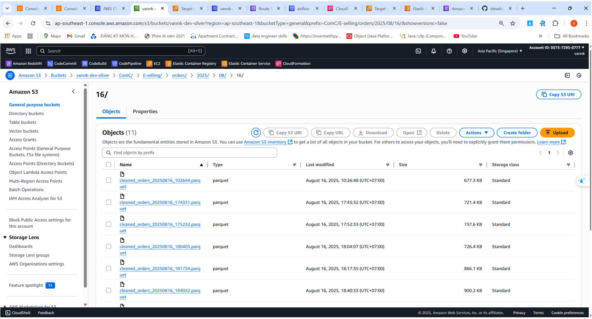

# Airflow on AWS EKS with CI/CD & Haravan API Pipeline

This project sets up a scalable, production-grade data orchestration platform using **Apache Airflow on AWS EKS**, integrated with **Haravan APIs**, and designed with modern engineering principles such as CI/CD automation, Medallion architecture, and the Factory Pattern.

---

## 🚀 Project Overview

- **Purpose**: Automate and scale data extraction pipelines from Haravan API into a Medallion data lake architecture (Bronze → Silver → Gold).
- **Technologies**: Apache Airflow, AWS EKS, Helm, CodePipeline, CodeBuild, ECR, CloudFormation, Kubernetes, Route53, Haravan API.

---

## ⚙️ Architecture Highlights

### 1. Airflow Deployment on AWS EKS
- Deployed Airflow via **Helm Chart** into **Amazon EKS** with three isolated environments:
  - `dev`
  - `staging`
  - `prod`
- Designed for **high availability**, **auto-scaling**, and **multi-AZ** redundancy within a single **VPC**.

### 2. KubernetesExecutor Mode
- Configured Airflow to use **KubernetesExecutor** to dynamically scale task execution on Kubernetes pods.
- Suitable for large-scale task parallelism with optimized resource allocation.

### 3. CI/CD Integration
- Fully automated DAG deployment using:
  - **GitHub** (source control)
  - **AWS CodePipeline** & **CodeBuild** (CI/CD)
  - **ECR** (Docker image registry)
  - **CloudFormation** (infrastructure as code)
- Each commit triggers build-test-deploy pipelines across all environments.

### 4. Custom Domain & DNS Setup
- Deployed Airflow webserver with a **branded domain name** via **Route 53**.
- Integrated with **Application Load Balancer (ALB)** for secure and scalable traffic routing.

---

## 🔄 Haravan ELT Pipeline

- Built modular **ELT pipelines** using the **Factory Pattern**, allowing reusable, scalable job creation for different Haravan API endpoints.
- Follows the **Medallion Architecture**:
  - **Bronze**: Raw data ingestion into S3
  - **Silver**: Cleaned, enriched datasets
  - **Gold**: Analytics-ready datasets

---

## 🧪 Testing & Quality Assurance

- Integrated **unit tests** and **integration tests** into the CI/CD pipeline.
- Tests are automatically executed before deployment to ensure pipeline stability and prevent regressions.

---

## 📁 Project Structure
<pre><code>
airflow-eks-docker/
│
├── config/ # Airflow config templates
├── dags/ # Airflow DAG definitions (ELT workflows)
├── integrationtests/ # Integration tests for full pipeline execution
├── script/ # Utility or bootstrap scripts for deployment
├── unittests/ # Unit tests for DAG components and operators
│
├── .env # Environment variables for local development
├── airflow.cfg # Base Airflow configuration file
├── docker-compose.yml # Local Airflow setup (optional for local dev)
├── Dockerfile # Docker image definition for Airflow
├── requirements-python3.7.txt # Python dependencies
├── unittests.cfg # Pytest/unittest configuration
│
aws-airflow-eks-config/ # EKS and Helm chart configurations
aws-cicd/cloudformation/ # CloudFormation templates for CI/CD pipeline
</code></pre>

---

<b>Airflow:</b>

<b>CICD:</b>

<b>Haravan Airflow Pipeline:</b>

<b>Redshift result:</b>

<b>S3:</b>
-bronze layer:

-silver layer:

