<h1>PROJECT AIRFLOW EKS CICD & HARAVAN API PIPELINE WITH FACTORY PATTERN DESIGN INTEGRATED</h1>

Deploy Airflow ready in Production in AWS EKS using HelmChart with 3 environments: Dev, Staging, Prod

Build CICD to automatically deploy new dag Airflow Pipeline into EKS cluster using AWS CICD (CodePipeline, CodeBuild, Github, ECR), Cloudformation

Build Airflow with Kubernetes Executor mode with highly availabity and scabality in 3 AZ in 1 VPC aws

Setup Airflow running with Beautiful Domain name using Route 53 integrate with Load balancer AWS

Build Haravan ELT pipeline with factory pattern design and Medalion architect. 
Integrate UnitTest and Integration to new airflow pipeline in CICD Airflow design.

Airflow:
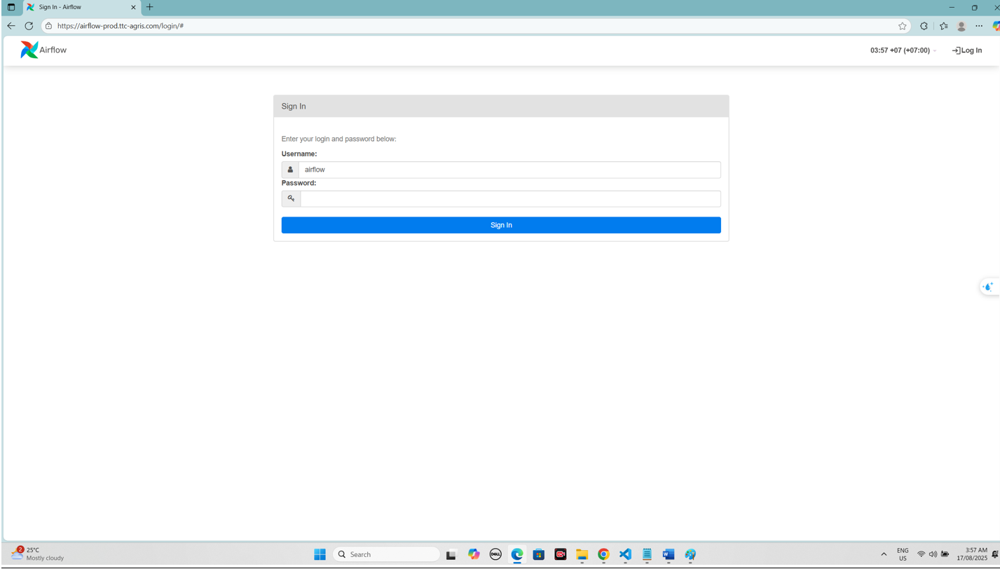

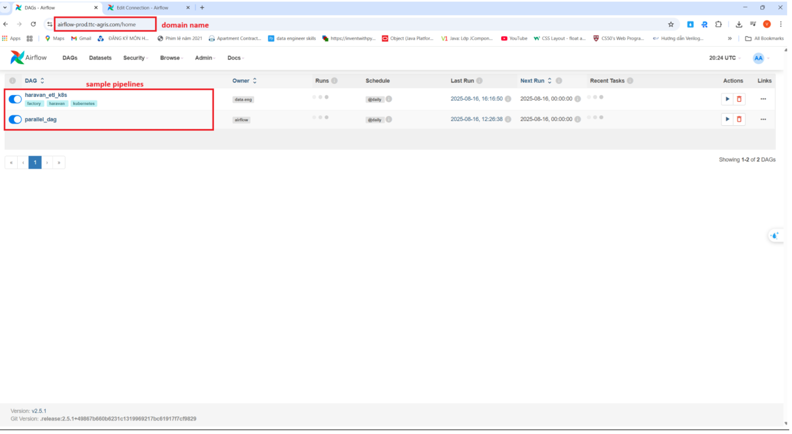

CICD:
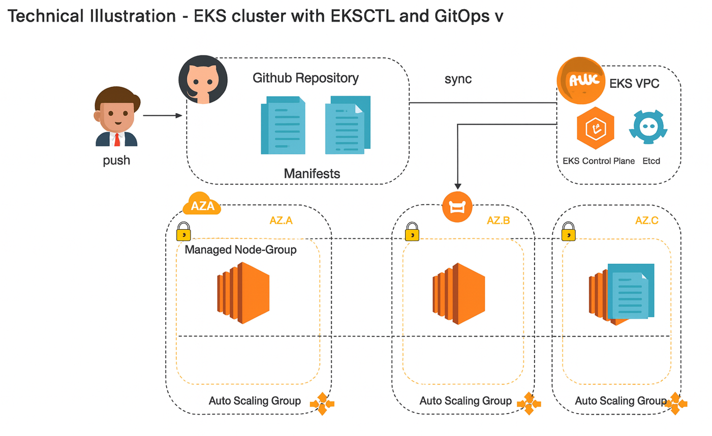

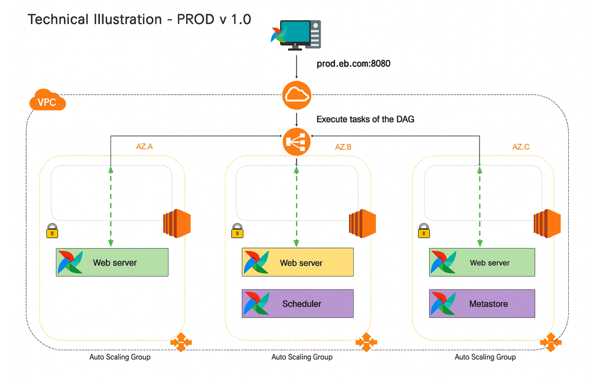

Haravan Airflow Pipeline:
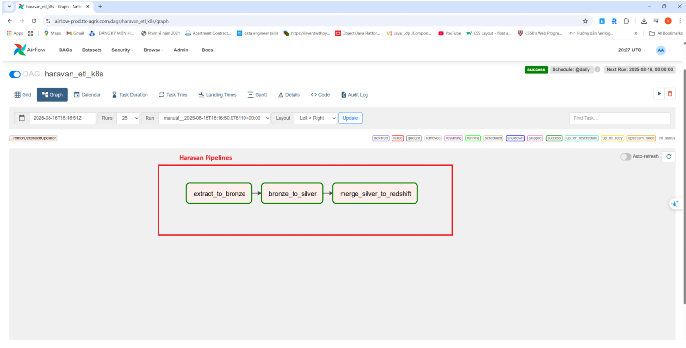

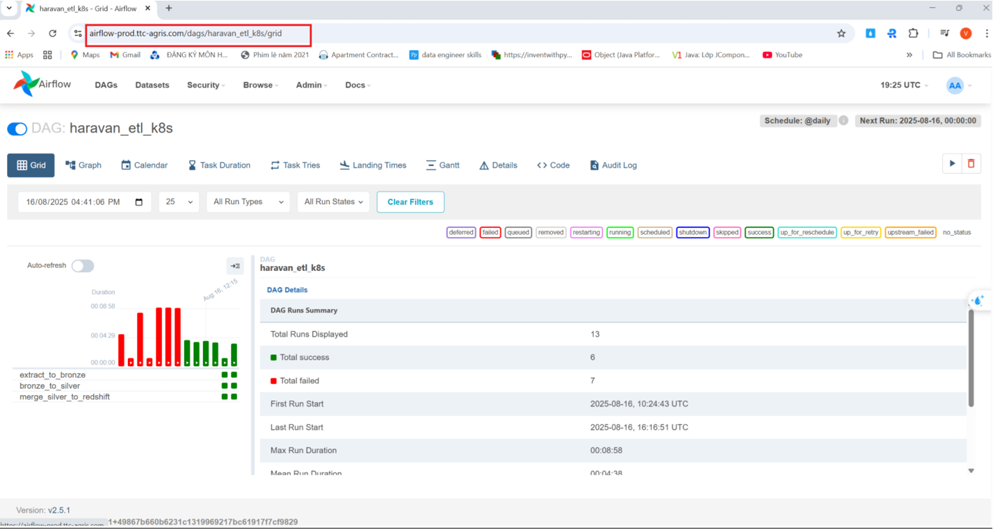

Redshift result:
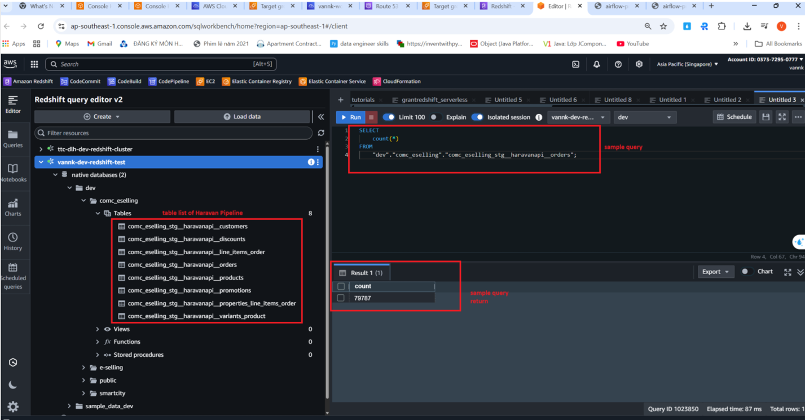

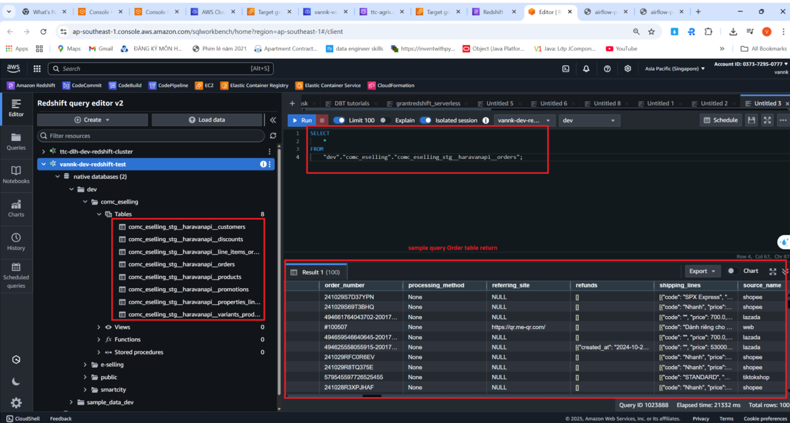

S3:
-bronze layer:
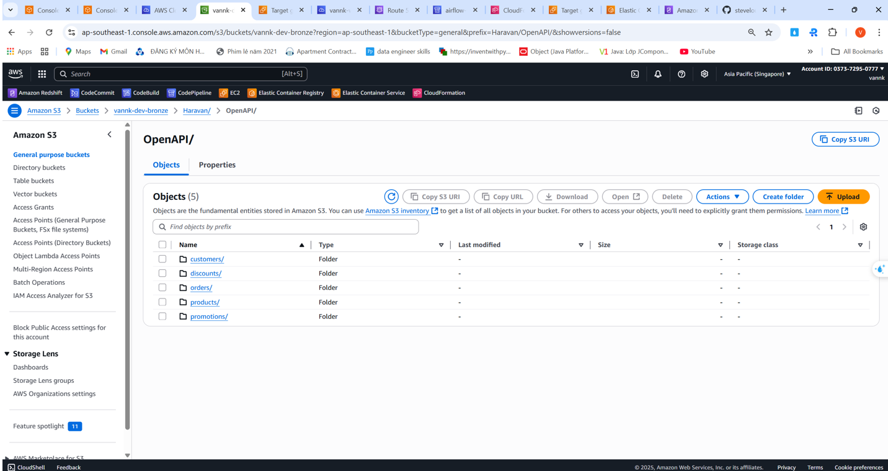

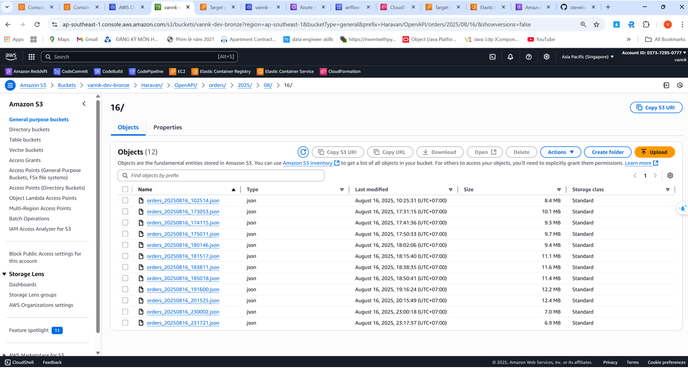

-silver layer:
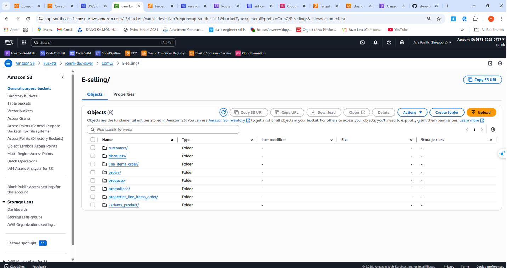

